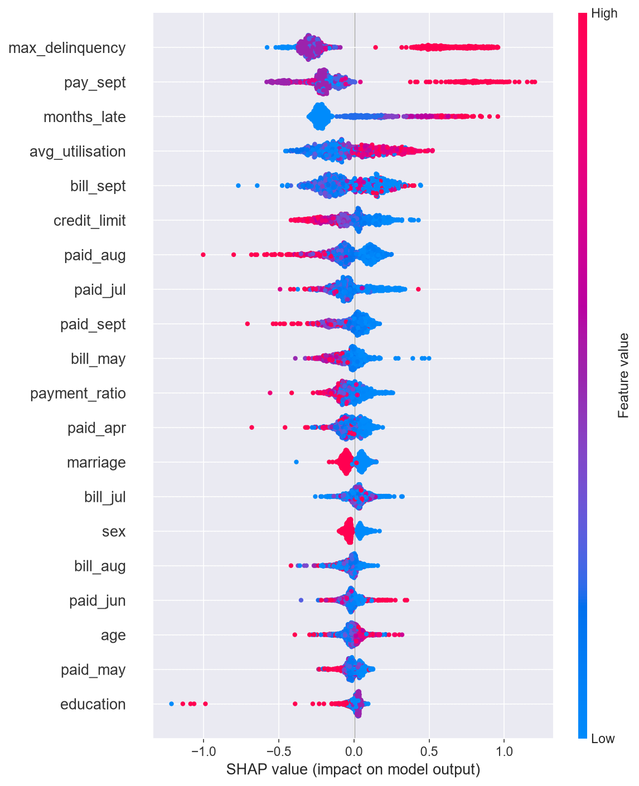
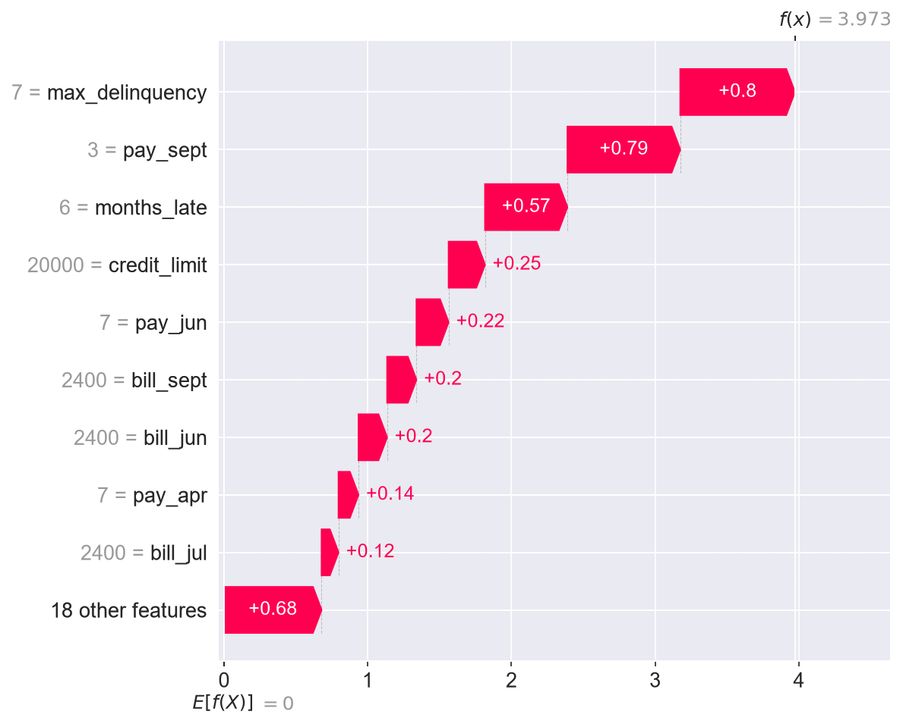

# Credit Default Risk Analytics

Predicting credit card default on 30,000 client records, with SQL-based exploration and SHAP model explainability for regulatory compliance.

## Results
- **XGBoost achieved ROC-AUC of 0.777** — in line with published benchmarks on this dataset
- **Engineered features dominate the model**: `max_delinquency`, `months_late`, and `avg_utilisation` rank as top predictors, none of which existed in the raw data
- **Falling one month behind doubles default risk** (13% → 34%); two months behind raises it to 69%
- **Simple and complex models perform near-identically** (LR 0.738 vs XGB 0.777), arguing for the interpretable model in a regulated context
- **SHAP waterfall plots produce adverse action explanations** — the specific, per-applicant reasons lenders are legally required to provide

## Visualizations

### SHAP Global Feature Importance

### Individual Prediction Explanation

## Dataset
**Source:** [UCI Default of Credit Card Clients](https://archive.ics.uci.edu/dataset/350/default+of+credit+card+clients) (CC BY 4.0)

30,000 Taiwanese credit card clients, 23 features covering credit limit, demographics, six months of repayment status, bill amounts, and payment amounts. Target: default in the following month (22.1% positive class).

## Approach

### 1. SQL exploration
Data was loaded into a SQLite database and explored with SQL rather than pandas, mirroring a warehouse-backed workflow. Queries are in [`queries.sql`](queries.sql).

Key finding — default rate by repayment status:

| Months behind | Clients | Default rate |
|---|---|---|
| Paid on time | 14,737 | 12.8% |
| 1 month | 3,688 | 34.0% |
| 2 months | 2,667 | 69.1% |
| 3 months | 322 | 75.8% |

Age proved a weak predictor by comparison (20.3%–28.3% across all age bands).

### 2. Feature engineering
Four features were derived from the six months of repayment history:
- `max_delinquency` — worst delinquency across the period
- `months_late` — count of months with any delay
- `avg_utilisation` — average bill as a proportion of credit limit
- `payment_ratio` — total paid over total billed

Ratio features were winsorised to [0, 2] to handle divide-by-near-zero artifacts.

### 3. Modelling

| Model | ROC-AUC | Precision | Recall | F1 |
|---|---|---|---|---|
| Logistic Regression | 0.738 | 0.44 | 0.60 | 0.51 |
| Random Forest | 0.775 | 0.49 | 0.61 | 0.54 |
| XGBoost | 0.777 | 0.47 | 0.62 | 0.53 |

Class imbalance handled via `class_weight='balanced'` and `scale_pos_weight`. Train/test split stratified on the target.

### 4. Explainability
SHAP was used for both global feature attribution and individual prediction explanations. The waterfall plot for the highest-risk client attributes the prediction to specific, reportable factors — maximum delinquency of 7 months, 3 months delinquent in September, late in all 6 billing cycles.

This matters because frameworks such as the US Equal Credit Opportunity Act require lenders to state specific reasons for adverse decisions. Global feature importance cannot produce a per-applicant explanation; SHAP can.

Note: `sex` and `marriage` contributed minimally to predictions. Given the legal risk of using protected attributes in credit decisions, removing them entirely would be advisable in production.

### 5. Threshold analysis
The decision threshold is a business input, not a modelling output. Moving from 0.7 to 0.3 reduces bad loans approved by roughly 75% but declines about four times as many applicants — a trade-off that depends on the lender's cost of default versus the lifetime value of a rejected customer.

## Tech Stack
Python · SQL (SQLite) · pandas · NumPy · scikit-learn · XGBoost · SHAP · matplotlib · seaborn · Git

## Project Structure
credit-default-risk-analytics/
├── data/credit.db # SQLite database
├── notebooks/
│ ├── 01_data_setup.ipynb # Data load, SQL exploration
│ └── 02_ml_model.ipynb # Feature engineering, models, SHAP
├── models/ # Saved models
├── dashboard/ # Exported plots
└── queries.sql # SQL queries

## Author
Abdullah Nasir — BSc Data Science, University of Calgary